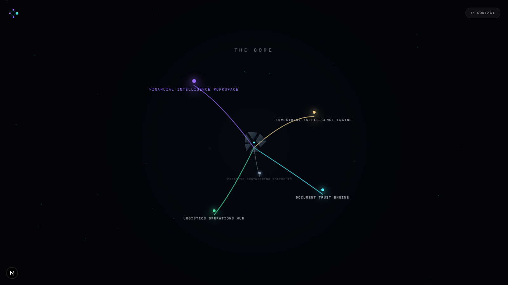
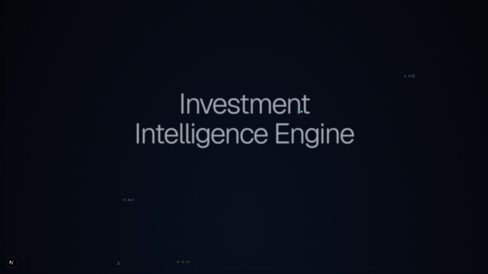
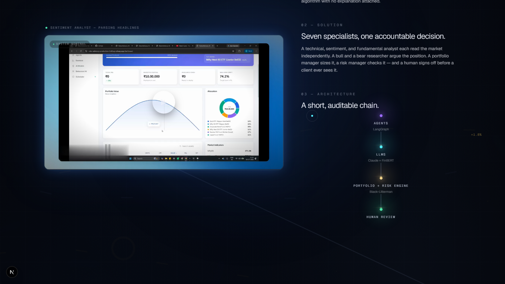
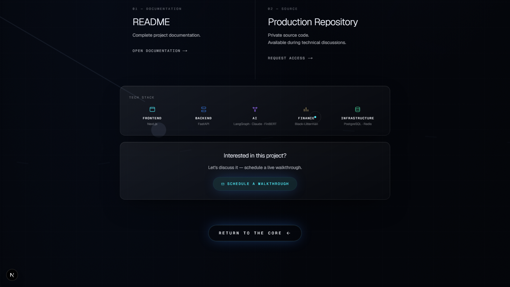

# Hello Client — Portfolio

An AI product studio's portfolio, built as a set of interactive "worlds" rather
than a static project list. A visitor arrives at a persistent, animated hub —
**The Core** — and picks a system to step into; each one runs a full
cinematic sequence (arrival → story → resources) before returning them to the
hub to choose the next.

## Overview

Most portfolio sites are a grid of cards. This one treats each flagship
project as its own destination: a full-viewport animated background, a
sticky product walkthrough, a scroll-driven editorial narrative, and a
resources screen (documentation, tech stack, contact) — all built once as a
shared framework and reused, with only content and a background motif
changing per project.

Five destinations live behind the hub today:

1. **Investment Intelligence Engine** — a multi-agent investment advisory system
2. **Financial Intelligence Workspace** — a citation-verified financial-filing analyst
3. **Document Trust Engine** — a document identity/fraud verification pipeline
4. **Logistics Operations Hub** — a customer-inquiry and operations platform
5. **Creative Engineering Portfolio** — the closing chapter: the practice behind all of them

## Problem

A portfolio that just lists past work reads like a résumé. It doesn't
communicate how a system was *designed* — the reasoning, the architecture
decisions, the tradeoffs — and it rarely holds attention long enough to make
the case for hiring the person who built it.

## Solution

One reusable "project world" framework — a hero arrival, a sticky-video
story screen with data-driven editorial beats (text / flow / metrics /
capability cards / future scope), and a resources screen — driven entirely by
per-project config objects. Each project only supplies its own copy, theme
colors, and an animated background motif (SVG/CSS for four projects, a WebGL
particle field for the fifth). The framework — layout, typography, motion
timing, spacing — never changes between projects; only the config does.

## Architecture

```
Home (/)
 ├─ ParticleField        — persistent WebGL background (react-three-fiber)
 ├─ BootSequence         — first-visit scripted intro, one-time per session
 └─ TheCore              — the animated hub; unfolds into 5 connected systems

Project world (/projects/[slug])
 ├─ WorldBackground       — per-project animated background (4 SVG/CSS motifs)
 │                          or ParticleField for the closing chapter
 ├─ Arrival               — hero: title, subtitle, reading-time-proportional reveal
 ├─ StoryScreen           — sticky video/preview (60%) + scrolling beats (40%)
 └─ ResourcesScreen       — README modal, repository, tech stack, CTA, return
```

Shared motion primitives (`src/components/investment-world/motion.ts`) and a
small accessibility hook (`src/components/useModalA11y.ts`) back every
screen and every modal (README, video lightbox, contact) consistently.

## Screenshots

| The Core | Project Hero |
|---|---|
|  |  |

| Story screen | Resources screen |
|---|---|
|  |  |

## Features

- **The Core** — a single animated hub connecting every project, with a
  signature "unfold" sequence and a quiet interaction hint before it opens
- **Five project worlds** on one shared framework — reading-time-aware hero
  copy, a 60/40 sticky-video story layout with six reusable "beat" kinds
  (text, flow diagram, engineering decisions, impact metrics, capability
  cards, future scope), and a consistent resources screen
- **Custom video lightbox** — pop-up player with full custom controls
  (play/pause, ±10s skip, scrub, mute, fullscreen), no page navigation
- **Contact form** wired to Web3Forms — no backend required
- **Accessibility** — `prefers-reduced-motion` respected across every
  ambient animation, modal focus-trapping with Escape-to-close and
  focus-restore, keyboard-reachable navigation throughout
- **Performance-tuned** — GSAP tweens gated by scroll visibility and paused
  entirely behind open modals, seeded-random background data computed once
  at module scope, custom cursor with dirty-checked hit-testing

## Technology Stack

- **Framework** — Next.js 16 (Turbopack), React 19, TypeScript
- **Styling** — Tailwind CSS v4
- **Motion** — GSAP (ScrollTrigger, MotionPathPlugin), Framer Motion
- **3D** — Three.js, React Three Fiber
- **Scroll** — Lenis smooth-scroll
- **Forms** — Web3Forms (no backend)

## Installation

```bash
git clone <this-repo>
cd hello_cllient
npm install
cp .env.example .env.local   # then fill in NEXT_PUBLIC_WEB3FORMS_ACCESS_KEY
npm run dev
```

Get a free Web3Forms access key at [web3forms.com](https://web3forms.com) —
enter the email that should receive contact-form submissions.

Other scripts:

```bash
npm run build       # production build
npm run start       # serve the production build
npm run lint        # ESLint
npm run typecheck   # tsc --noEmit
```

## Project Structure

```
src/
├── app/
│   ├── page.tsx                    # Home (Hero + Core)
│   ├── projects/[slug]/page.tsx    # Project-world router
│   └── globals.css                 # Design tokens, keyframes, reduced-motion rules
├── components/
│   ├── TheCore.tsx                 # The hub
│   ├── BootSequence.tsx            # First-visit intro
│   ├── ParticleField.tsx           # WebGL background (react-three-fiber)
│   ├── CustomCursor.tsx
│   ├── ContactModal.tsx            # Web3Forms-backed contact form
│   ├── useModalA11y.ts             # Shared focus-trap / Escape / focus-restore hook
│   ├── InvestmentWorld.tsx / FinancialReportWorld.tsx / DocumentTrustEngine.tsx /
│   │   LogisticsOperationsHub.tsx / CreativeEngineeringSystem.tsx  # Per-project orchestrators
│   └── investment-world/           # The shared project-world framework
│       ├── Arrival.tsx / StoryScreen.tsx / ResourcesScreen.tsx
│       ├── WorldBackground.tsx     # 4 animated background motifs
│       ├── ReadmeModal.tsx / VideoLightbox.tsx / FlowPrimitives.tsx
│       ├── motion.ts               # Shared GSAP primitives
│       ├── types.ts                # WorldTheme / WorldContent / StoryBeat
│       └── configs/                # One config file per project (content only)
└── data/
    └── projects.ts                 # Project metadata (name, accent, tagline, metrics)
```

## Future Scope

- Additional project worlds as new work ships
- A written case-study/blog section using the same editorial beat system
- Lightweight analytics on which systems visitors spend the most time in

## License

All rights reserved — see [LICENSE](LICENSE). Published for portfolio and
code-review purposes; not licensed for reuse. Get in touch if you'd like to
discuss access to the production implementation.

## Contact

**contact@orynthbuild.site**
